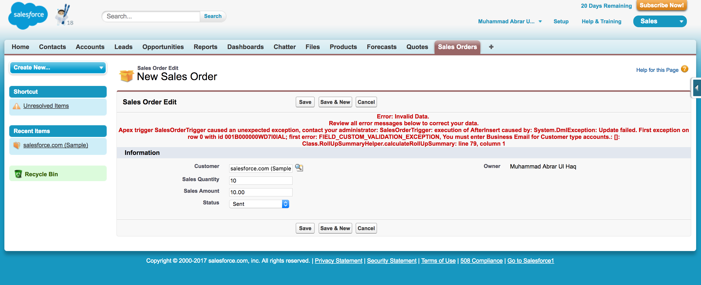
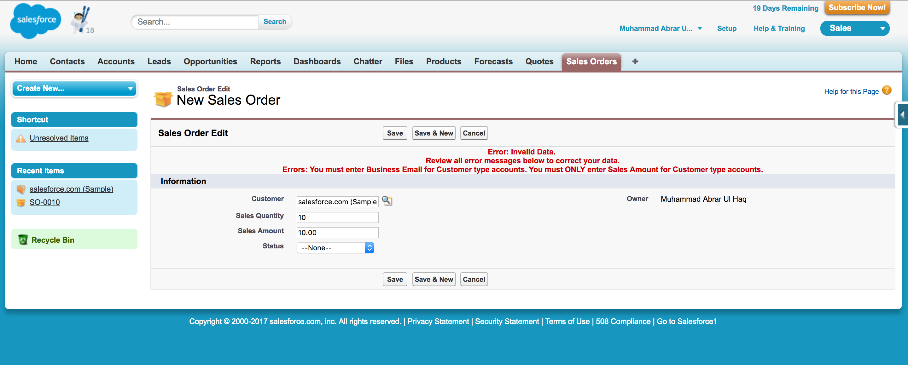

# Salesforce Lookup Rollup Summaries

As of now the Roll Up Summaries (COUNT, MIN, MAX, SUM) are ONLY available for Master-Detail relationship and NOT for Lookup relationship.

If you have a Lookup relationship between 2 objects then you need to write an Apex trigger on child object to get the Roll Up Summaries (COUNT, MIN, MAX, SUM) on parent object. Here you will find an example of code snippet for the Lookup Rollup Summaries.

### Example Considerations
1. Here in this example we have Account (a standard object) and SalesOrder__c (a custom object).
2. There is a Lookup relationship between Account and SalesOrder__c. An Account can have one "or many SalesOrder__c records.

### Considerations of Lookup Rollup Summaries
1. The Rollup Summaries logic should consider insert, update and delete operations.
2. The trigger should handle validation rules of child and as well as parent objects.
3. The exceptions should be handled gracefully and in a user-friendly manner.
4. Use "Database.DML" statement instead of normal "DML" statement. The "Database.DML" statement does partial in a batch of 200 records.

##### Error shown to user in DML Statement

##### Error shown to user in Database.DML Statement

#### A great tool on Rollup Summaries for administrators 
https://github.com/afawcett/declarative-lookup-rollup-summaries
